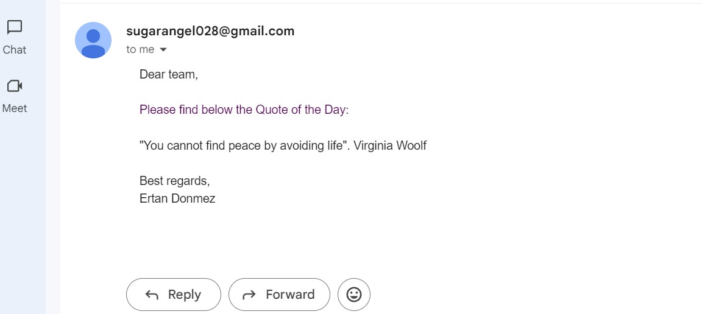

# Quote of the Day Scraper and Email Sender
This Python script scrapes the "Quote of the Day" from a specified website, and then sends the quote via email. It is designed to automate the process of fetching a motivational quote and sharing it through email.

## Features
   - `Web Scraping:` Uses `BeautifulSoup` and `requests` to fetch the quote of the day from quoteoftheday.nu.
   - `Email Sending:` Uses Python's `smtplib` and `email.mime.text` to send the scraped quote to a predefined email address.
   - `Error Handling:` Includes error handling for failed web requests, improper data formatting, and email sending issues.
## Prerequisites
Before running the script, make sure you have the following installed:

1. `Python 3.x`

2. `Libraries:` Install the required Python packages using pip
```bash
pip install requests beautifulsoup4
```
3. `App Password:` For Gmail users, you'll need to create an App Password from your Google account (under Security settings > App Passwords). Do not use your regular Gmail password for security reasons.

## How It Works
1. `Fetching the Quote:` The script sends a GET request to https://www.quoteoftheday.nu/ and parses the HTML to extract the quote of the day using BeautifulSoup.

2. `Email Content:` After fetching the quote, the script formats it into an email message.

3. `Sending the Email:` The email is sent using Gmail's SMTP server with SSL. You'll need to log in using your email and the app password created for secure access.

## Usage
### Running the Script
1. Clone the repository and navigate to the project directory:
```bash
git clone https://github.com/your-username/quote-of-the-day-scraper.git
cd quote-of-the-day-scraper
```
2. Open the script and update the following:

   - `Sender's Email:` Replace `your_email` with your Gmail address.
   - `App Password:` Replace `your_app_password` with your Gmail app password.
   - `Recipient's Email:` Replace the email address in `message['To']` with your desired recipient's email.
     
3. Run the script:
```bash
python quote_of_the_day.py
```
## Example Output
When the script is executed, it prints the quote and author to the console and sends the following email:
<p></p>

## Code Breakdown
**`fetch_data()`**
- Sends a GET request to fetch the HTML content from the target website.
- Returns the HTML content if the request is successful.

**`collect_data(html)`**
- Parses the HTML using `BeautifulSoup` and extracts the quote from the specified `div` tag.
- Returns the formatted quote text.

**`send_email(quote_text)`**
- Composes and sends an email containing the quote of the day.
- Uses the `smtplib` library to connect to Gmail's SMTP server securely.

**`__main__`**
The main function orchestrates the process of fetching, collecting, and sending the quote via email.

## Environment Variables
It is highly recommended that you use environment variables to store sensitive information like your email and app password.
```python
import os
email_user = os.getenv('EMAIL_USER')
email_password = os.getenv('EMAIL_PASS')
```
You can set these variables in your system or in a `.env` file (if using a library like `python-dotenv`).

## Notes
- `Gmail Setup:` Ensure that you have enabled 2FA and created an App Password for sending emails securely via Gmail.
- `Error Handling:` The script includes basic error handling, but it can be extended as per your use case.
## License
This project is open-source and free to use under the MIT License.

## Contribution
Feel free to fork the repository, open an issue, or submit a pull request if you would like to contribute to the project.

This `README.md` provides all the details necessary for others to understand and run your project effectively. You can modify or extend it as needed.

